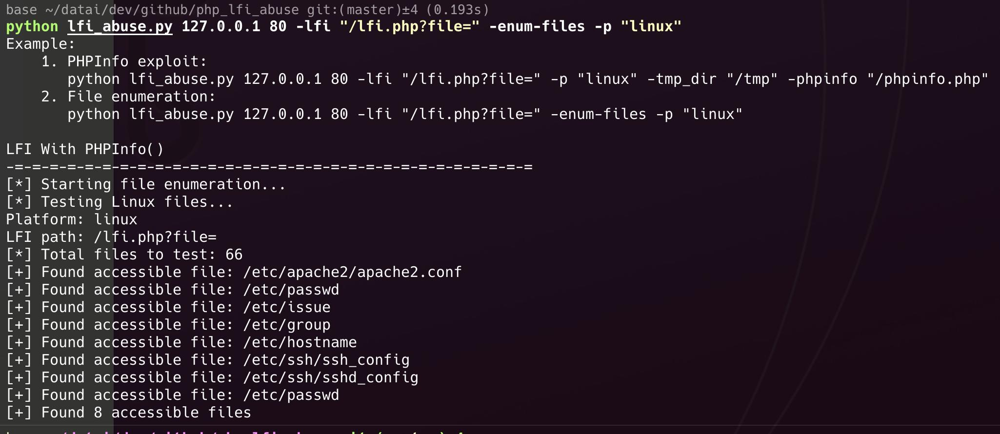
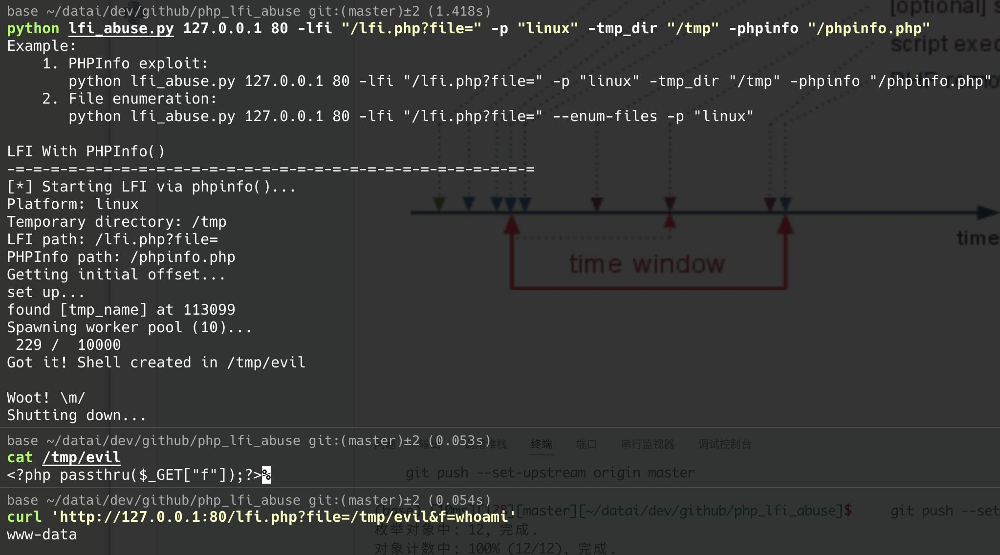

# LFI Abuse Tool

A comprehensive tool for exploiting Local File Inclusion (LFI) vulnerabilities in web applications.

## Features

The LFI Abuse Tool has two primary operating modes:

1. **File Enumeration Mode**: Scan and identify files that can be accessed through LFI vulnerabilities on the target server
2. **PHPInfo Exploitation Mode**: Leverage PHPInfo() temporary file disclosure to create a webshell on the target server

## Requirements

- Python 3.x
- Required Python packages:
  ```
  requests
  urllib3
  ```

## Usage

### Basic Syntax

```
python lfi_abuse.py <host> <port> -lfi <lfi_path> [options]
```

### Command Line Arguments

| Argument               | Description                                              |
| ---------------------- | -------------------------------------------------------- |
| `host`               | Target hostname or IP address                            |
| `port`               | Target port number                                       |
| `-lfi`               | LFI vulnerable path (e.g., "/lfi.php?file=")             |
| `-phpinfo`           | Path to phpinfo.php file (default: "php/phpinfo.php")    |
| `-p`, `--platform` | Target platform: "linux" or "windows" (default: linux)   |
| `-tmp_dir`           | Temporary directory path for shell creation              |
| `-t`, `--threads`  | Number of threads for PHPInfo exploitation (default: 10) |
| `--enum-files`       | Enable file enumeration mode                             |

## Examples

### 1. File Enumeration Mode

- Attempts to access common system files through the LFI vulnerability
- Tests multiple file paths for both Linux and Windows systems
- Reports all accessible files found

Scan for accessible files on a Linux target:

```
python lfi_abuse.py 192.168.1.10 80 -lfi "/vulnerable.php?file=" --enum-files -p "linux"
```

Scan for accessible files on a Windows target:

```
python lfi_abuse.py 192.168.1.10 80 -lfi "/vulnerable.php?file=" --enum-files -p "windows"
```



### 2. PHPInfo Exploitation Mode

- Exploits a race condition in PHPInfo page with file uploads
- Creates a PHP webshell in the target server's temporary directory
- Uses multi-threading to increase exploitation success rate

Create a webshell using PHPInfo temporary file disclosure:

```
python lfi_abuse.py 192.168.1.10 80 -lfi "/vulnerable.php?file=" -phpinfo "/phpinfo.php" -tmp_dir "/tmp"
```



## Disclaimer

This tool is provided for educational and legitimate security testing purposes only. The authors are not responsible for any misuse or damage caused by this tool.

# Thanks

https://insomniasec.com/downloads/publications/LFI%20With%20PHPInfo%20Assistance.pdf

https://github.com/vulhub/vulhub/tree/master/php/inclusion

https://github.com/roughiz/lfito_rce

https://github.com/takabaya-shi/LFI2RCE

https://github.com/0bfxgh0st/lfi2rce
